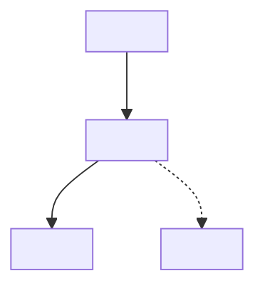

# <Project> — Agent Guide

<One-line description.> This file is the map every agent reads first. Depth lives in `docs/` —
follow the pointers below, don't guess.

> The cross-project standard ("The Standard", "How we build", working style, working in parallel)
> auto-loads from the global `~/.claude/CLAUDE.md`. This file is the per-project tuning on top of it:
> what THIS repo is, where things live, how to run it, and its hard rules.

## Structure
<Top-level layout — apps, packages, where the entry points are. A few lines.>

## Map (the rail) — seed `docs/MAP.md` on day one
The single traversable spine an agent follows to reach any part of the system — a road, not a forest.
This routes **code** (how a request/command/job flows + the copy-this entrypoint for each backbone
concern); a doc index (`docs/OVERVIEW.md`, if present) routes docs — don't duplicate it. Rules: keep
it ONE screen, spine-only, **descriptive** (verify a path before trusting it), link out for depth, add
a row only for a **shared, recurring** subsystem (rule of three), and never list a path that doesn't
exist yet (mark in-flight surfaces as one un-anchored "evolving" row). Skeleton to fill:

````markdown
# MAP — the rail
The spine of this system: how <a request / a command / a job> flows, and where each backbone part
lives. Descriptive of current reality; spine-only — verify a path before trusting it.



| Subsystem | Copy-this entrypoint (file:symbol) | The rail (canonical pattern) | Depth |
|-----------|-----------------------------------|------------------------------|-------|
| <e.g. request lifecycle> | `src/...:NN` `fn()` | <one line: the pattern to follow> | [doc](...) |
````

Adapt the spine to the stack: API → `route → service → store`; CLI → `command → handler → core`;
worker/event → `trigger → queue → handler`. Wire it in: point `## Structure` and the README at it.

## Where things live (write to the right place)
- `docs/` — committed, durable knowledge: architecture, runbooks, conventions, post-mortems. Decisions go here.
- `tmp/` — GITIGNORED working state: plans, briefs, scratch. Never the source of truth.
- A durable lesson goes in `docs/` or a rule/check — never left only in `tmp/` or chat.

## Commands
- Dev: `<...>`   Build: `<...>`   Install: `<...>`
- Test: `<...>`   Lint/typecheck: `<...>`

## Definition of Done — all must hold
- Typecheck + lint clean in every app you touched; the project's check suite exits 0.
- Docs updated for what changed (see `docs/OVERVIEW.md` if present).
- Reviewed — self-review is too generous on non-trivial work.
- "Merged" ≠ "shipped" if deploys are manual — say which.

## Hard rules (non-negotiable)
- **No `git push` or external deploy without explicit approval** — all branches, all remotes, every time.
- Never log or commit secrets. <Project-specific safety invariants here.>
- No `git add -A`; no emojis.
- Commit trailer: `Co-Authored-By: Claude Opus 4.7 (1M context) <noreply@anthropic.com>`.

## Read-on-demand (progressive disclosure)
- <Area> → `docs/<file>.md`
- Current work queue → `tmp/<...>` (gitignored)
